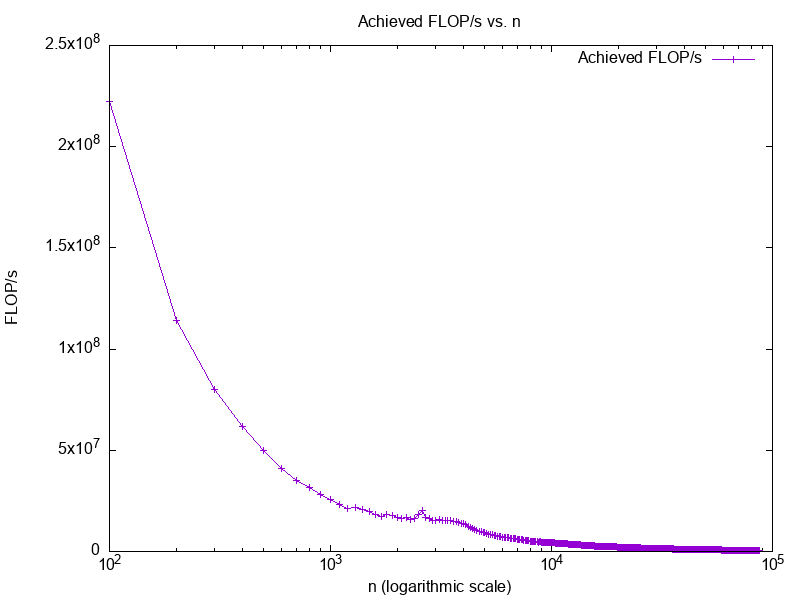

# Assignment 2

- [Assignment 2](#assignment-2)
  - [Matrix in C](#matrix-in-c)
  - [Cache Hierarchy](#cache-hierarchy)


## Matrix in C

(See implementation in `triad.c`)
```c
double **matrix_new(int rows, int cols)
{
    double **matrix = (double **)malloc(rows * sizeof(double *));
    for (int i = 0; i < rows; i++) {
        for (int j = 0; j < cols; j++) {
            matrix[i][j] = i * cols + j;
        }
    }
    return matrix;
}

void matrix_delete(double **matrix)
{
    for(int i = 0; matrix[i] != NULL; i++) { free(matrix[i]); }
    free(matrix);
}
void matrix_print(int rows, int cols, double **matrix)
{
    for (int i = 0; i < rows; i++) {
        for (int j = 0; j < cols; j++) {
            printf("%f ", matrix[i][j]);
        }
        printf("\n");
    }
}
void matrix_vector_mul(int rows, int cols, double **matrix, double *x, double *y)
{
    for (int i = 0; i < rows; i++) {
        y[i] = 0.0;
        for (int j = 0; j < cols; j++) {
            y[i] += matrix[i][j] * x[i];
        }
        printf("\n");
    }
}
```


## Cache Hierarchy

```c
for(size_t j = 0; j < NITERS; j++) {
    for(size_t i = 0; i < n; i++) {
        a[i] = b[i] + c[i] * d[i];
    }
}
```

> Plot your results in a graph that shows n on the x-axis (logarithmic scale) and achieved FLOP/s on the y-axis:



The four vectors fit in cache for each of the cache levels:


> compute the maximum vector length n such that the four vectors fit in cache for each of the cache levels.

Namely, the CPU is designated as `Apple M1 Pro`.

Equivalent of `lscpu -C` in MacOS (arm architecture):
```shell
$ sysctl -a | grep cpu
kern.sched_rt_avoid_cpu0: 0
kern.cpu_checkin_interval: 5000
hw.ncpu: 10
hw.activecpu: 10
hw.perflevel0.physicalcpu: 8
hw.perflevel0.physicalcpu_max: 8
hw.perflevel0.logicalcpu: 8
hw.perflevel0.logicalcpu_max: 8
hw.perflevel0.cpusperl2: 4
hw.perflevel1.physicalcpu: 2
hw.perflevel1.physicalcpu_max: 2
hw.perflevel1.logicalcpu: 2
hw.perflevel1.logicalcpu_max: 2
hw.perflevel1.cpusperl2: 2
hw.physicalcpu: 10
hw.physicalcpu_max: 10
hw.logicalcpu: 10
hw.logicalcpu_max: 10
hw.cputype: 16777228
hw.cpusubtype: 2
hw.cpu64bit_capable: 1
hw.cpufamily: 458787763
hw.cpusubfamily: 4
machdep.cpu.cores_per_package: 10
machdep.cpu.core_count: 10
machdep.cpu.logical_per_package: 10
machdep.cpu.thread_count: 10
machdep.cpu.brand_string: Apple M1 Pro
# now we can look at the cache
$ sysctl -a | grep cache
hw.perflevel0.l1icachesize: 196608
hw.perflevel0.l1dcachesize: 131072
hw.perflevel0.l2cachesize: 12582912
hw.perflevel1.l1icachesize: 131072
hw.perflevel1.l1dcachesize: 65536   #   <------ L1
hw.perflevel1.l2cachesize: 4194304  #   <------ L2
hw.cacheconfig: 10 1 2 0 0 0 0 0 0 0
hw.cachesize: 3416047616 65536 4194304 0 0 0 0 0 0 0
hw.cachelinesize: 128
hw.l1icachesize: 131072
hw.l1dcachesize: 65536
hw.l2cachesize: 4194304
```


L1 Data Cache (`hw.l1dcachesize: 65536 bytes`):

Assuming you have four vectors (a, b, c, and d), and each is of type double (8 bytes), so the total data size is ${4 * 8 * n}$ bytes.
To fit in the L1 data cache, you need ${4 * 8 * n <= 65536}$.
Solve for `n`: ${n <= 8192 (bytes / (4 * 8))}$.

L2 Cache (`hw.l2cachesize: 4194304 bytes`):

Similar to the L1 data cache, you need to ensure that the total data size fits in the L2 cache.
To fit in the L2 cache, you need ${4 * 8 * n <= 4194304.}$
Solve for n: ${n <= 131072 (bytes / (4 * 8)).}$